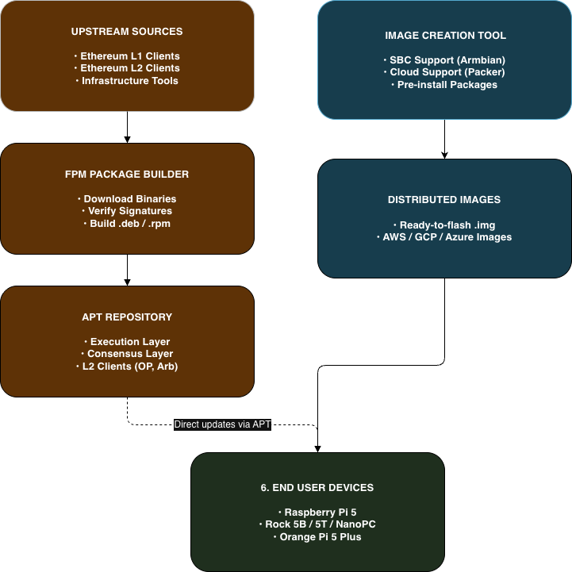
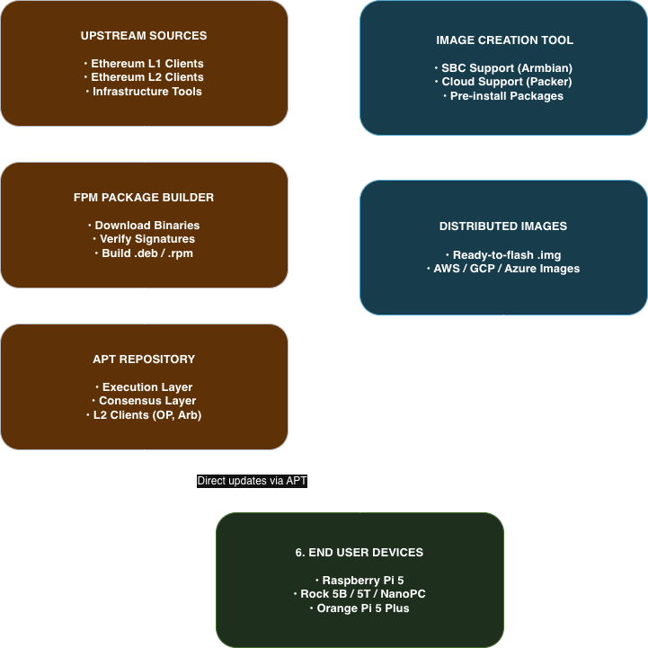

.. _architecture:

======================
Project Architecture
======================

This page provides an overview of the Ethereum on ARM project architecture, illustrating how source code is transformed into distributed packages and ready-to-run images.

High-Level Architecture
=======================

The project pipeline flows from upstream source code through our build systems to final artifacts (packages and images) consumed by end users.

1. **Package Builder**: Compiles binary packages (`.deb`) from upstream sources for ARM64.
2. **APT Repository**: Hosts these packages, allowing for standard `apt install` and updates.
3. **Image Creation Tool**: Builds full operating system images pre-installed with the repository and configuration scripts.
4. **End Users**: Consume either the packages (existing systems) or full images (new deployments).

Component Details
=================

1. FPM Package Builder
----------------------

Located in ``fpm-package-builder/``, this component is responsible for:

*   **Fetching Sources**: Downloading upstream releases or cloning repositories.
*   **Compilation**: Compiling binaries for ``linux/arm64`` (if not pre-built).
*   **Packaging**: Wrapping binaries, systemd services, and default configuration into Debian (`.deb`) packages.

**Directory Structure:**

.. code-block:: text

   fpm-package-builder/
   ├── l1-clients/        # Execution & Consensus clients (Geth, Prysm, etc.)
   ├── l2-clients/        # Layer 2 solutions (Optimism, Arbitrum)
   ├── infra/             # DVT, MEV-Boost, Monitoring
   └── utils/             # System utilities

2. Image Creation Tool
----------------------

Located in ``image-creation-tool/``, this component builds the final OS images.

*   **SBC Images**: Uses **Armbian** build tools to create bootable images for specific hardware (Rock 5B, Raspberry Pi 5).
*   **Cloud Images**: Uses **Packer** to build Amazon Machine Images (AMI) and other cloud formats (VHD, GCE).

3. Configuration Standards
--------------------------

To ensure consistency across the ecosystem, all packages adhere to a strict standard:

*   **Service Management**: All clients run as **systemd** services.
*   **User Isolation**: Services run under the dedicated ``ethereum`` user.
*   **Config Location**: All environment flags are loaded from ``/etc/ethereum/<client>.conf``.
*   **Data Persistence**: Data is stored in ``/home/ethereum/.<client>``.

This standardization allows users to mix and match any combination of Execution and Consensus clients easily.
